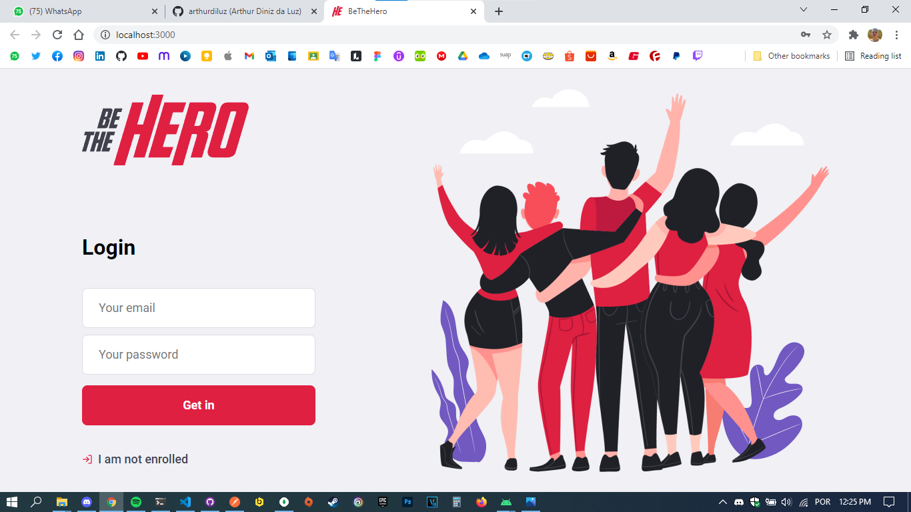
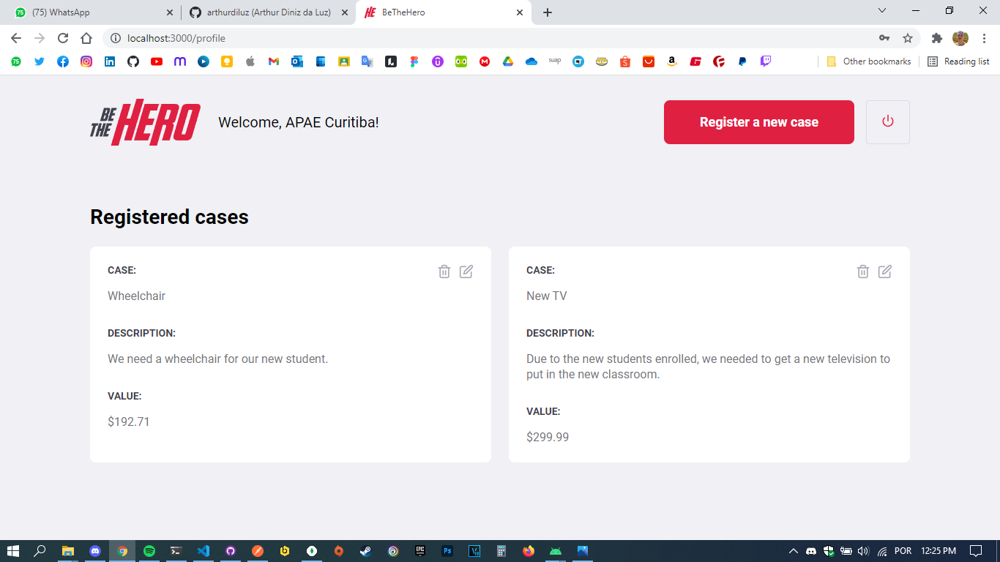
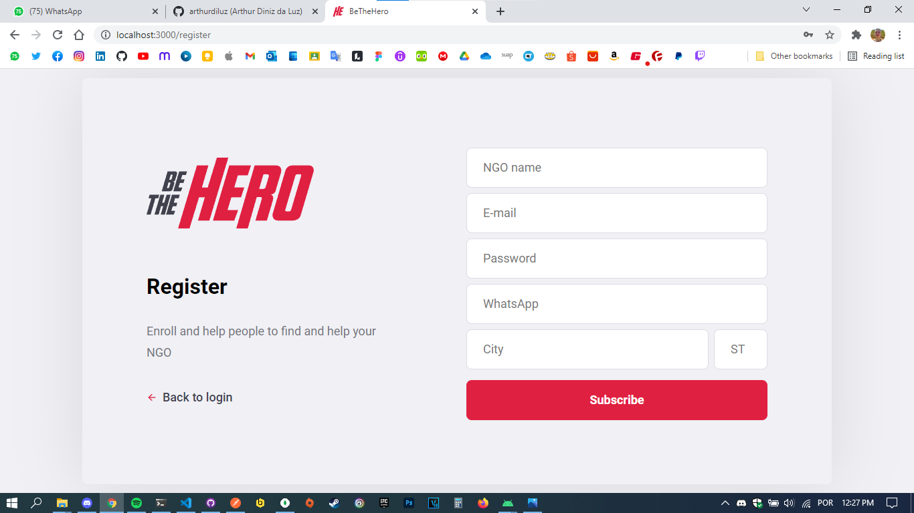
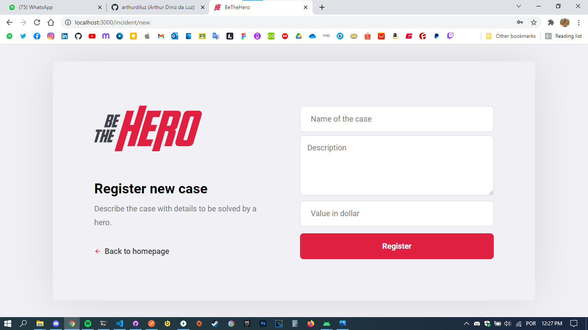

BeTheHero
==

- [BeTheHero](#bethehero)
- [Introduction](#introduction)
- [How to run](#how-to-run)
  - [Server](#server)
  - [Web](#web)
  - [Mobile](#mobile)
- [Interface](#interface)
  - [Web interface](#web-interface)
  - [Mobile interface](#mobile-interface)
- [Author](#author)

Introduction
==

This full-stack project started during the **Semana Omnistack 11** to practice some web frameworks and concepts. Since then, I have been updating the project and adding new features as I learn something new.

> **BeTheHero** is a platform where NGOs can request currency support, and anyone can help by donating money to their cases.

The following technologies are being used in the project:

- **web server:** NodeJS with Express
- **database:** MongoDB
- **web interface:** React
- **mobile:** React Native through Expo
- **validations:** Express Validator
- **tests:** Supertest

How to run
==

- ⚠️ You **must** run the server module in the background so you can use both the web and the app.

- **Optional:** Join the [Postman project](https://app.getpostman.com/join-team?invite_code=b02a2202a9a49f73d0204c76bf28580f&ws=efe91281-b49e-481b-9bd3-01f98681182e).

Server
--

**Note: make sure your NodeJS is updated.**

First, install the dependencies in _package.json_.

`> npm install`

Now you need to create an acount in [MongoDB Atlas](https://cloud.mongodb.com/), create a project named 'BeTheHero', a database named 'bethehero', and then connect to MongoDB through the URI in *./server/src/database/index.js*.

Now you're able to run the server.

**PRODUCTION:** *`> npm start`*

**DEVELOPMENT:** *`> npm run dev`*

Now your server application must be running in the selected address.
You can now execute web and/or mobile application.

Web
--

First, install the dependencies in _package.json_.

`> npm install`

Now you're you can run the web application.

`> npm start`

Now the development server will run and the addresses of your application will appear on Terminal.
The website will also open automatically in your main browser.

Mobile
--

First, install the dependencies in _package.json_.

`> npm install`

⚠️ **IMPORTANT:** you'll have to edit **api.js** file and insert your computer's ID in the **baseURL** attribute _(line 8)_.

Now you're you can run the app.

`> npm start`

Now the Expo DevTools will open in your browser as well as the Metro Bundler.
There, you'll be able to choose where you'll run your application.
You can choose between:

- Android device or emulator
- iOS device or emulator *(emulator available only for macOS)*
- Web browser (emulated)

**if any errors occurred, try to run the following command:**

>`> npm audit fix`

and the packages will be fixed.

# Interface

## Web interface

### **Login screen**

### **Homepage**

### **Register NGO**

### **Register Incident**

---
## Mobile interface

### **Home screen**

### **Case screen**

### **Texting through WhatsApp**

### **Texting through E-mail**

---

Author
==

This project has been developed by [Arthur Diniz da Luz](https://arthurdiluz.github.io/).
